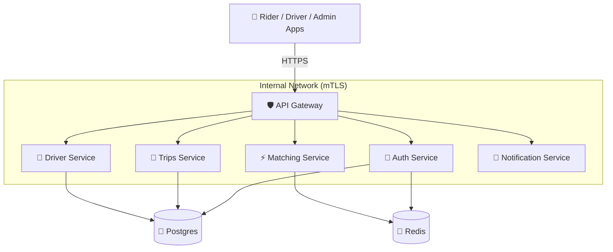
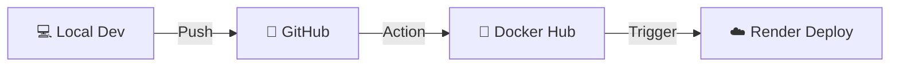

# 🚖 Real-Time Ride-Hailing Backend - High-Level Design

---

## 1. 🌟 Overview

This backend powers a **real-time ride-hailing platform** designed to scale like Uber or Ola.
The system is built using **Microservices**, **API Gateway**, **JWT Authentication**, and **Cloud-Native Deployment** with Docker + Render. It leverages **Supabase (Postgres)** for reliable persistence and **Upstash (Redis)** for high-speed caching and real-time features.

---

## 2. 🏗️ Architecture Summary

---

## 3. 🧩 Microservices Breakdown

### 🔐 3.1 Auth Service
**Security Core of the Platform**
- **Responsibilities**:
  - 👤 User Registration & Login
  - 🔑 JWT Access & Refresh Token Management
  - 🛡️ Session Management & Account Lockout
  - 🚦 Rate Limiting
  - 🔄 JWKS Key Rotation (via Vault)
- **Data Stores**:
  - `Postgres`: Users, Refresh Tokens, Sessions
  - `Redis`: Rate Limits, Lockout State

### 🚕 3.2 Trips Service
**The Ride Lifecycle Engine**
- **Responsibilities**:
  - 📍 Create Trip Requests
  - 💰 Dynamic Price Estimation
  - 🔄 Trip Lifecycle (Requested → Matched → Started → Completed)
  - 📜 Trip History & Invoicing
- **Data Stores**:
  - `Postgres`: Trips, Invoices

### ⚡ 3.3 Matching Service
**Real-Time Driver Allocation**
- **Responsibilities**:
  - 📡 Streaming Driver Locations (WebSocket/Redis)
  - 🔍 Finding Nearest Drivers (Geo-Spatial)
  - 🤖 Automatic Driver Assignment
  - 🔁 Retry & Fallback Logic
- **Data Stores**:
  - `Redis`: Live Driver Locations, Matching Queue

### 👤 3.4 Driver Service
**Driver & Vehicle Management**
- **Responsibilities**:
  - 📝 Driver Registration & Verification
  - 🟢 Availability Status (Online/Offline)
  - 🚗 Vehicle Details Management
- **Data Stores**:
  - `Postgres`: Driver Profiles, Documents

---

## 4. 🛠️ Key Technologies

| Component | Technology | Badge |
| :--- | :--- | :--- |
| **API Gateway** | Spring Cloud Gateway |  |
| **Services** | Spring Boot + Java/Kotlin |  |
| **Database** | Supabase (Postgres) |  |
| **Cache/Queue** | Upstash (Redis) |  |
| **Deployment** | Render (Docker) |  |
| **Security** | Vault + mTLS |  |

---

## 5. 🛡️ Gateway Responsibilities
> **Single Entry Point for All Clients**

- ✅ **JWT Validation**: Verifies tokens before routing.
- 🆔 **Context Injection**: Adds `X-User-ID` header for downstream services.
- 🚦 **Global Rate Limiting**: Protects the system from abuse.
- 🔀 **Smart Routing**: Directs traffic to the correct microservice.
- 📄 **API Documentation**: Centralized Swagger/OpenAPI endpoint.
- 🔒 **Internal Security**: mTLS certificate-based authentication with services.

---

## 6. 🔐 Authentication Security Model

### 🎫 6.1 Access Token
- **TTL**: 5 Minutes (Short-lived)
- **Storage**: In-Memory (Stateless)
- **Validation**: Verified by Gateway using **JWKS**.

### 🔄 6.2 Refresh Token
- **Security**: Stored as **SHA256 Hash** in DB.
- **Binding**: Bound to `UserId` + `DeviceId` + `UserAgent` + `IP`.
- **Protection**: **Rotated** on every use (One-time use) to prevent replay attacks.

### 🔑 6.3 Key Rotation
- **Mechanism**: Keys stored in **HashiCorp Vault**.
- **Rotation**: Gateway pulls public keys periodically via JWKS endpoint.

### 🚫 6.4 Account Lockout
- **Rule**: 5 Failed Attempts → **30 Minute Lock**.
- **Storage**: State managed in **Redis** for speed.

### 📉 6.5 Rate Limits
| Endpoint | Limit |
| :--- | :--- |
| `/auth/register` | **10** req/min |
| `/auth/login` | **50** req/min (per IP) |
| `/auth/refresh` | **20** req/min |

---

## 7. 💾 Database (Supabase Postgres)
**Single Postgres Instance** with logical separation via schemas/tables.

- `users` 👤
- `drivers` 🚕
- `sessions` 📱
- `vehicles` 🚗
- `trips` 🗺️
- `trip_events` ⏱️
- `payment_methods` 💳
- `audit_logs` 📝

> **Why Supabase?** Free tier, Hosted Backups, SSL, Easy Integration.

---

## 8. 🚀 Redis (Upstash)
**High-Performance Data Layer**

- ⚡ **Rate Limits**: Sliding window counters.
- 🔒 **Account Lockout**: Temporary ban keys.
- 📍 **Driver Locations**: Geo-spatial index for matching.
- 📥 **Matching Queue**: Job queue for trip assignments.
- 📱 **Device Sessions**: Fast session validation.

> **Why Upstash?** Serverless, Global Low-Latency, REST API support.

---

## 9. ☁️ Deployment Design

### Render Services
Each microservice runs in its own **Docker Container**:

- `https://rido-auth.onrender.com`
- `https://rido-gateway.onrender.com`
- `https://rido-trips.onrender.com`
- `https://rido-driver.onrender.com`
- `https://rido-matching.onrender.com`

> Gateway routes internal traffic securely.

---

## 10. 🔄 CI/CD Pipeline

- **GitHub Actions**:
  - 🧪 Run Tests
  - 🏗️ Build Docker Image
  - 📤 Push to Docker Hub
  - 🚀 Trigger Render Deployment

---

## 11. 🔌 Frontend Integration

**All Apps Talk to Gateway Only**

- `POST /gateway/auth/login`
- `POST /gateway/trips/book`
- `GET  /gateway/driver/nearby`
- `POST /gateway/matching/assign`

> **Benefit**: Hides internal complexity, provides a clean public API, and simplifies CORS/Security.

---

## 12. 📈 Scaling Strategy (Future Vision)

- **Kubernetes (K8s)**: For orchestration.
- **Replicas**: Multiple instances of stateless services (Auth, Gateway).
- **Redis Cluster**: For distributed caching.
- **Read Replicas**: Postgres read-only nodes for analytics.

---
