# 🔐 Auth Service

The **Auth Service** is the security core of the Rido backend, handling user identity, authentication, and session management.

## 🏗️ Architecture & Features

```mermaid
graph TD
    Client[📱 Client Apps] -->|HTTPS / JWT| Gateway[🛡️ API Gateway]
    Gateway -->|mTLS / X-User-ID| Auth[🔐 Auth Service]

    subgraph "Core Features"
        Auth -->|1. Protect| RateLimit[🚦 Rate Limiting]
        Auth -->|2. Guard| Lockout[🚫 Account Lockout]
        Auth -->|3. Sign| Keys[🔑 Key Rotation]
        Auth -->|4. Track| Sessions[📱 Session Mgmt]
        Auth -->|5. Bind| Device[📲 Device Binding]
    end

    RateLimit -.-> Redis[(🔴 Redis)]
    Lockout -.-> Redis
    Sessions -.-> DB[(🐘 Postgres)]
    Keys -.-> Vault[(🔒 Vault)]
    Device -.-> DB
```



## 📚 Documentation

Detailed documentation is available in the following files:

- **[📖 API Documentation](API_DOCUMENTATION.md)**
  - Public Endpoints (Register, Login, etc.)
  - Internal Admin APIs
  - Request/Response Models

- **[🏗️ System Architecture](SYSTEM_ARCHITECTURE.md)**
  - Security Features (Rate Limiting, Lockout, mTLS)
  - Key Rotation & Vault Integration
  - Infrastructure Dependencies (Redis, Postgres)

## 🚀 Quick Start

### Prerequisites
- Java 21
- Docker (for Postgres/Redis/Vault)

### Run Locally
```bash
./gradlew bootRun
```

### Run Tests
```bash
./gradlew test
```
